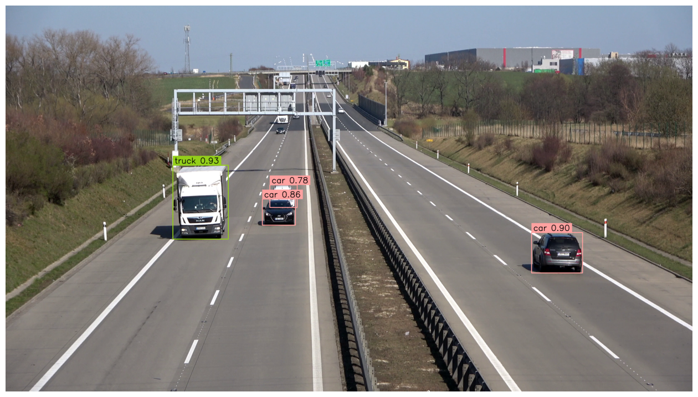

# Track and Count Vehicles with YOLOv8

This project provides a Python implementation for tracking and counting vehicles in video footage using YOLOv8 for object detection and ByteTrack for tracking. The solution is designed to process video input, detect vehicles, track their movement across frames, and count them as they pass predefined lines.

# Demo



## Features

- **Vehicle Detection:** Utilizes YOLOv8 for real-time object detection.
- **Vehicle Tracking:** Integrates ByteTrack for robust multi-object tracking.
- **Counting Mechanism:** Counts vehicles crossing user-defined lines in the video.
- **Annotation:** Annotates the video with bounding boxes, tracker IDs, and line-crossing events.

## Requirements

Ensure you have the following dependencies installed:

- Python 3.8+
- OpenCV
- NumPy
- YOLOv8 (`ultralytics` package)
- tqdm

Install dependencies via pip:

```bash
pip install ultralytics opencv-python-headless numpy tqdm
```

## Files

- `track_and_count_vehicles_with_yolov8.ipynb`: Jupyter notebook containing the full implementation for tracking and counting vehicles in video footage.
- Example video files can be provided to test the solution.

## Usage

### 1. Clone the Repository

```bash
git clone https://github.com/m4s1t4/track-objectDetection.git
cd track-objectDetection
```

### 2. Open the Notebook

Run the Jupyter notebook:

```bash
jupyter notebook track_and_count_vehicles_with_yolov8.ipynb
```

### 3. Modify Configurations

Adjust the following variables in the notebook as needed:

- `SOURCE_VIDEO_PATH`: Path to the input video.
- `TARGET_VIDEO_PATH`: Path to save the annotated output video.
- `LINE_START` and `LINE_END`: Coordinates defining the line for vehicle counting.
- `CLASS_ID`: List of YOLOv8 class IDs corresponding to vehicles (e.g., cars, trucks).

### 4. Execute the Notebook

Follow the notebook's cells to:

- Load the YOLOv8 model.
- Process the video.
- View the annotated output video with tracking and counting.

## Code Structure

The main steps in the implementation include:

1. **Initialization:**

   - Load the YOLOv8 model and configure parameters.
   - Initialize ByteTrack and annotators for visualization.

2. **Frame Processing:**

   - Extract frames from the video.
   - Detect vehicles using YOLOv8.
   - Track detected vehicles across frames using ByteTrack.
   - Annotate the video frames with bounding boxes and tracker IDs.

3. **Counting Vehicles:**

   - Define a line in the video.
   - Count vehicles that cross the line based on tracking data.

4. **Output:**
   - Save the annotated video with bounding boxes, tracker IDs, and line-crossing events.

## Troubleshooting

- **Error: `AttributeError: module 'numpy' has no attribute 'float'`**:

  - This error occurs due to the deprecation of `np.float` in NumPy 1.20. Update the code to replace `np.float` with `float` or `np.float64`.

- **Video Path Issues:** Ensure the video file exists at the specified `SOURCE_VIDEO_PATH` and is accessible.

- **Dependency Errors:** Ensure all required Python packages are installed and up to date.

## Contributing

Contributions are welcome! Feel free to submit a pull request or report issues.

## License

This project is licensed under the MIT License.

## Acknowledgments

- [YOLOv8 by Ultralytics](https://github.com/ultralytics/ultralytics)
- [ByteTrack](https://github.com/ifzhang/ByteTrack)
